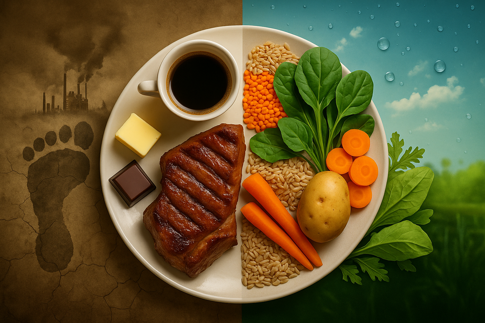
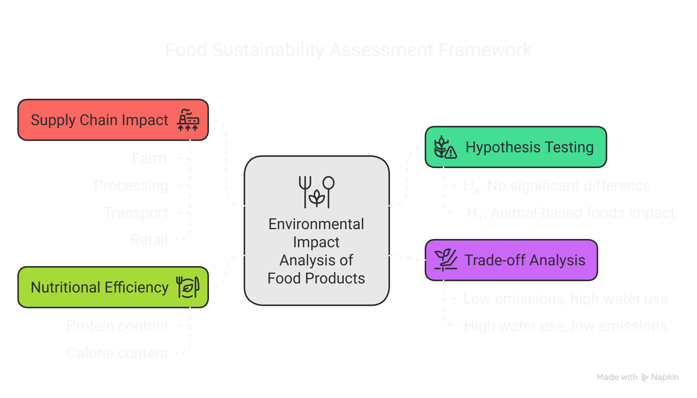
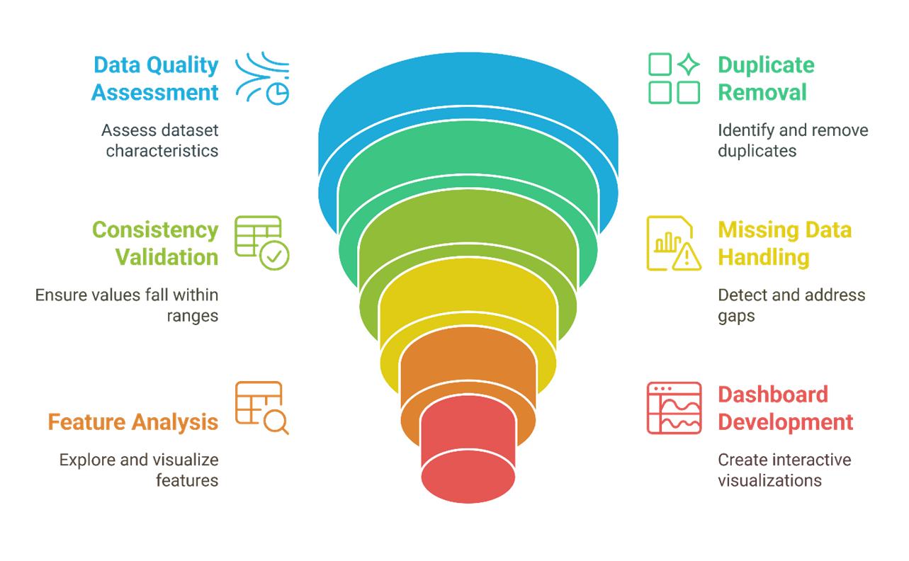
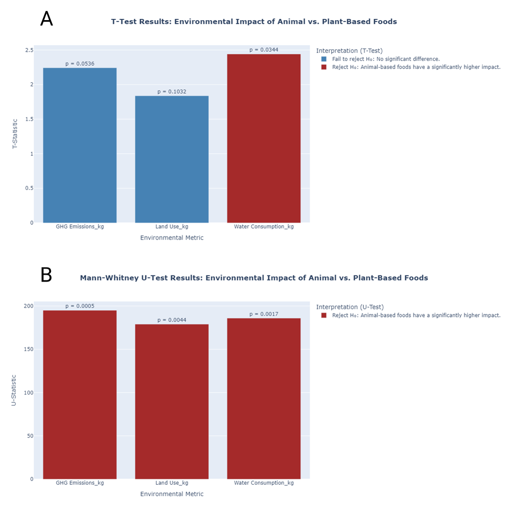
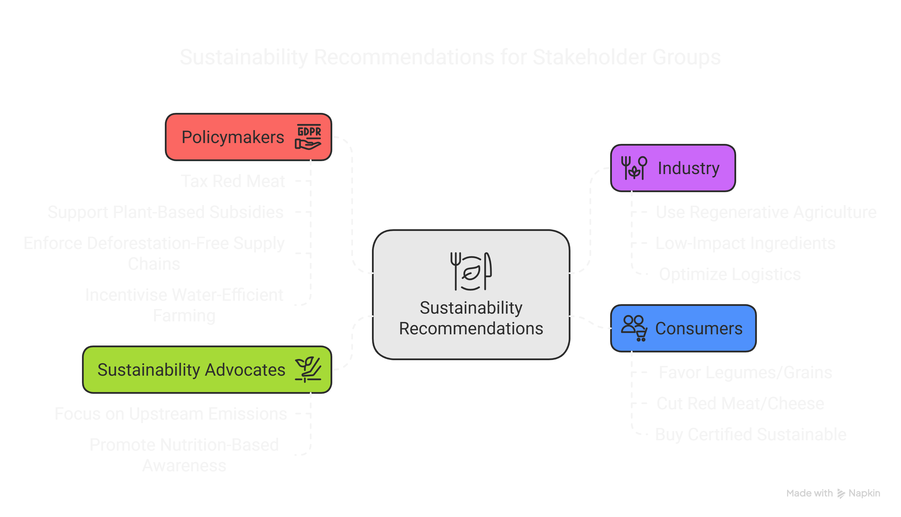
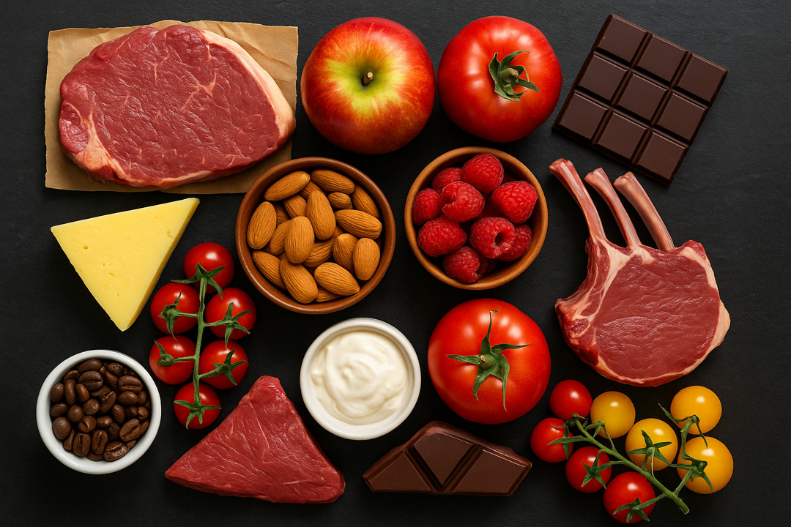

# 🌍 Hidden Cost of Your Dinner Plate: What Foods Are Hurting the Planet the Most?

> _“Every time you spend money, you're casting a vote for the kind of world you want.” – Anna Lappé_



Welcome to the GitHub repository for the project **"Environmental Impact of Food Production"**, which explores the sustainability of the foods we eat—quantifying their effects on our planet through emissions, land use, water scarcity, and eutrophication.

---

## 🥗 Project Overview

Agriculture is a leading driver of climate change, deforestation, water depletion, and aquatic pollution. But not all food products have the same environmental impact.

This project investigates **43 commonly consumed food items**, from beef to bananas, analysing their footprint across four critical dimensions:

- 🌫️ Greenhouse Gas (GHG) Emissions  
- 🌾 Land Use  
- 💧 Water Consumption  
- 🧪 Eutrophication Potential (Nutrient Pollution in Water)

The goal? To help consumers, policymakers, and industry leaders **make smarter food choices** that benefit both people and planet.



---

## 📊 Key Questions Explored

- Which foods contribute the most to climate change?
- How do animal-based vs. plant-based foods compare?
- What supply chain stages are the most emission-intensive?
- Are there trade-offs between water use, land use, and emissions?
- Which foods should we eat more or less of?
- Are these differences statistically significant?

---

## 🔬 Methodology

This project followed a robust, structured process with transparency and reproducibility in mind:

### 1. 🧼 Data Cleaning & Preprocessing
- Removed duplicates and non-essential columns  
- Standardized column names for clarity (e.g., `GHG_1000kcal`)  
- Categorized foods into animal-based and plant-based, with relevant subcategories

### 2. ❌ Handling Missing Data
- Applied a 30% missing threshold to filter out 10 food items (e.g., tofu, soymilk, shrimp)
- Used grouped medians, regression modeling, and skew-aware imputation for the remaining 33 products

### 3. 📈 Exploratory & Multivariate Analysis
- **Univariate**: Distribution of GHG, land, water  
- **Bivariate**: Trade-offs between food types and sustainability metrics  
- **Multivariate**: Comparative analysis using weight, calories, and protein

### 4. 📊 Interactive Dashboards
Built in Power BI for public exploration and stakeholder engagement. Features include:
- Emissions breakdown by food type or supply chain stage  
- Views normalized by kcal, kg, and grams of protein  
- Filters for deeper comparisons and strategic decision-making



---

## 📌 Results Summary

### 🥩 Animal vs. 🌱 Plant-Based Foods
- Animal products contribute **66.48%** of total emissions—**twice** as much as plant-based items  
- Beef, lamb, and cheese top the list of worst offenders  
- Legumes, vegetables, and grains are the most sustainable overall

### 🔥 Top Climate Offenders
- **Beef (beef herd)** alone accounts for over **26%** of total food emissions  
- **Dark chocolate** and **coffee** are surprisingly high-impact due to land use and processing

### 🚜 Emissions by Supply Chain Stage
- **Farm stage**: 59.44% of all emissions  
- **Land use change**: 21.55%  
- Downstream activities like transport and packaging contribute relatively little

### 🔄 Trade-Offs Analysis
- Red meat = high GHG, land, and water impact  
- **Nuts**: low emissions, **but** water-thirsty  
- **Tomatoes**: well-balanced between nutrition and sustainability

### 🧪 Eutrophication and Dual Burdens
- **Beef**, **coffee**, and **dark chocolate** are among the worst for both climate and water pollution  
- **Farmed fish** and **tomatoes** show more balanced profiles, albeit with caveats

### 🌊 Water Scarcity vs. Nutrition
- **Apples**, **berries**, and **nuts** are extremely water-inefficient per gram of protein  
- **Beef** has high GHG emissions but relatively lower water use per protein compared to some plants  
- **Coffee** is an outlier: low water use, high GHG, minimal nutrition

---

## 📐 Statistical Validation

To test if the environmental impact of **animal-based** vs. **plant-based** foods is significantly different:

- Applied both **t-tests** and **Mann-Whitney U tests**
- Due to non-normal distributions and unequal variances, the **Mann-Whitney U test** was more robust
- ✅ Results: **Animal-based foods have significantly higher impacts** across all key metrics (p < 0.05)



---

## ✅ Conclusion

This analysis reveals a clear sustainability gap:

- **Animal-based foods**—especially red meat and dairy—carry disproportionate environmental costs
- **Plant-based foods**—especially legumes, grains, and vegetables—are low-impact and nutritious
- **Supply chain interventions** must focus upstream (farming, land use, feed)
- **Statistical evidence** supports dietary shifts and regulatory policies to curb food-related emissions

---

## 🧭 Recommendations

### For Policymakers:
- Subsidize sustainable crops, tax high-emission foods  
- Enforce deforestation-free supply chains  
- Promote water-efficient agriculture

### For Industry:
- Reformulate products using low-impact ingredients  
- Improve agricultural practices and logistics  
- Use science-based labeling and sourcing strategies

### For Sustainability Advocates:
- Focus on upstream emissions (farm, feed, land)
- Educate on nutritional density vs. environmental impact

### For Consumers:
- Prioritize legumes, grains, and vegetables  
- Cut down on red meat and cheese  
- Choose certified sustainable brands



> **A more sustainable food future starts with what’s on your plate—then scales through policy and innovation.**

---

## 🙌 Acknowledgments

This project was completed as part of my training with **Azubi Africa**. I highly recommend Azubi Africa for their transformative, hands-on learning programs in data analytics and beyond.

📚 Learn more about their work here: [Azubi Africa](https://azubiafrica.org)

---

## 📁 Repository Contents

| Folder/File              | Description |
|--------------------------|-------------|
| `data/`                  | Dataset used for analysis and final cleaned data for Power BI |
| `notebooks/`             | Jupyter notebook for data cleaning, EDA, and analysis |
| `assets/`               | Graphs, charts, and exported dashboards |
| `deliverables/`                | Full narrative write-up and exportable summary presentation |
| `README.md`              | You’re here! Overview of the project and findings |

---

## 📎 Citation

If you use or reference this project, please cite it as:

```
Imoro, N. (2024). Environmental Impact of Food Production. GitHub. https://github.com/Nfayem/environmental_impact_of_food_production
```

---

## 👤📇 Author Contact & Portfolio


📍 **Location**: Tema, Ghana  
📧 **Email**: [nfayem.imoromensah@hotmail.com](mailto:nfayem.imoromensah@hotmail.com)  
🔗 **LinkedIn**: [linkedin.com/in/nfayem-imoro](https://linkedin.com/in/nfayem-imoro)  
🐙 **GitHub**: [@Nfayem](https://github.com/Nfayem)  
📂 **Project Repo**: [Environmental Impact of Food Production](https://github.com/Nfayem/environmental_impact_of_food_production)  
✍️ **Medium Article**: [Hidden Cost of Your Dinner Plate](https://medium.com/@nfayem.imoromensah/hidden-cost-of-your-dinner-plate-what-foods-are-hurting-the-planet-the-most-3a8b30dd99c3)  
📊 **Power BI Dashboard**: [Data-Driven Solutions for a Sustainable World](https://app.powerbi.com/view?r=eyJrIjoiYjIzNDU4MmMtNzI2OC00MDQ2LTkxYzMtODM3NDk5ZjkzZTE0IiwidCI6IjQ0ODdiNTJmLWYxMTgtNDgzMC1iNDlkLTNjMjk4Y2I3MTA3NSJ9)  

---

## 🚀 Get Involved

Questions, feedback, or ideas?  
Feel free to open an issue or submit a pull request!

> **Your next meal is more than a choice - it's a vote for the future you want.**

